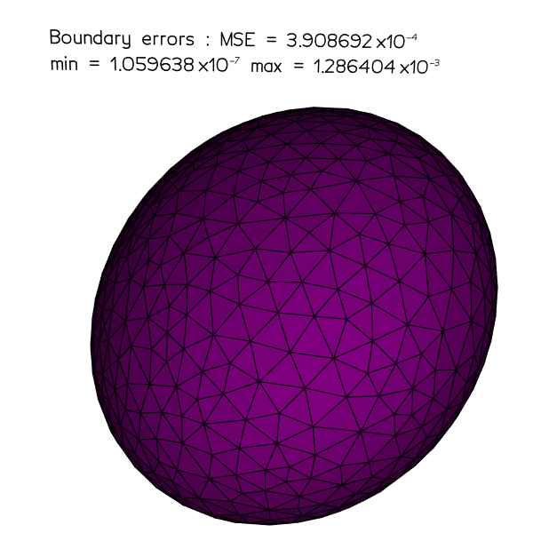

This repository has for objective of regrouping different Python tools for using LevelSets functions defined domains : 

- creation of a set of boundary points from numpy arrays of values of LS function; 
- creation of conforming meshes from numpy arrays of values of LS function, that can be used with [*FEniCS*](https://fenicsproject.org/); 

The creation of 3D meshes is also available but is not optimal because of the high computation time.

Boundary reconstruction | 2D mesh reconstruction | 3D mesh reconstruciton
--- | --- | ---
 |  | 

For `./from_ls_to_bd_points.py` the required Python packages are very standard and can be installed by :

```bash
pip install numpy matplotlib scipy 
```

For `./from_ls_to_meshes.py` the installations are slightly more complex and are detailed in [`install_and_use_mmg.md`](https://github.com/KVuillemot/PhiFEM_and_FNO/blob/main/install_and_use_mmg.md)  ([https://github.com/KVuillemot/PhiFEM_and_FNO/blob/main/install_and_use_mmg.md)](https://github.com/KVuillemot/PhiFEM_and_FNO/blob/main/install_and_use_mmg.md)). Moreover, if you want to use your meshes with *FEniCS*, you can install it through a conda environment with the following : 


```bash 
conda create --name envname python=3.11
conda activate envname 
conda install -c conda-forge fenics mshr 
pip install numpy matplotlib scipy
```
